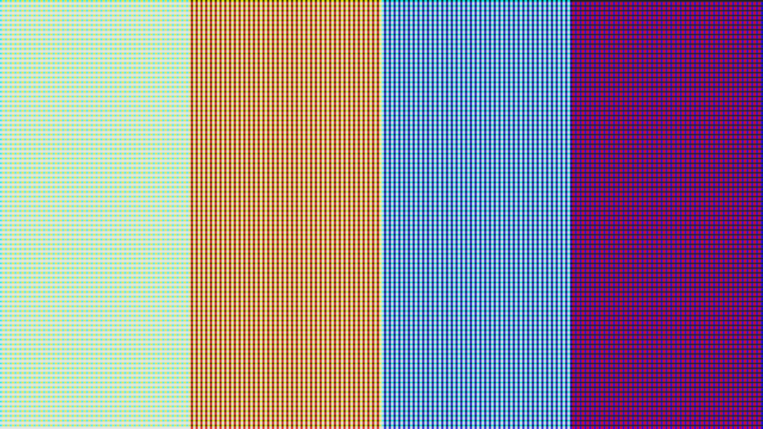
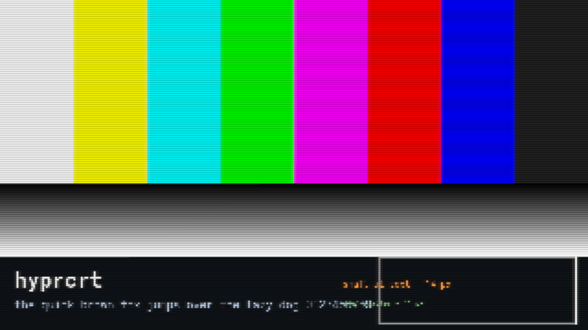
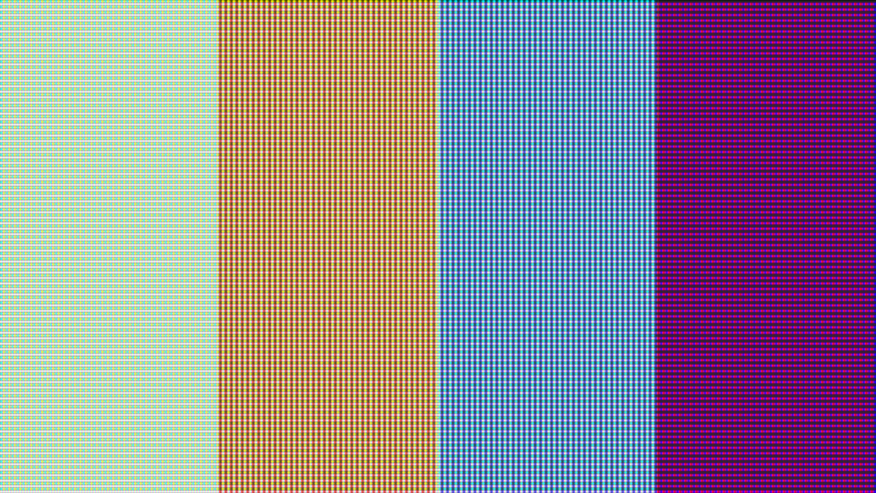
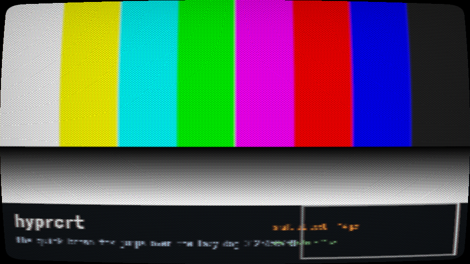

# hyprcrt

A system-wide CRT filter for Hyprland, packaged as an Omarchy plugin and usable on plain Hyprland.

It is the tube model from [an-earlier-project](../an-earlier-project) (`crt.c`) and its GPU port in an-earlier-project,
applied to the whole screen: energy-conserving scanlines whose beam fattens with brightness, an
aperture-grille / slot / shadow phosphor mask with the mean folded back to one, halation, a phosphor
afterglow trail, per-gun sharpness (red bleed), gamma, and Lottes' curved glass with vignette and
rounded corners. Four presets (Plain, Scanlines, Monitor, Television) and six knobs.

| Plain | Scanlines | Monitor | Television |
|---|---|---|---|
|  |  |  |  |

The same test card through the four presets at pitch 3 (`docs/previews/`, rendered offscreen by
`tests/shadercheck`); `docs/previews/monitor_zoom.png` is the Monitor preset at 3× so you can see
the mask and the beam.

Two modes, one product:

| | Lite | Full |
|---|---|---|
| How | Hyprland's built-in `decoration:screen_shader`, one generated fragment pass | A Hyprland plugin (`plugin/`) that runs a seven-pass chain at the end of every frame |
| Needs | nothing to build | a prebuilt library for your Hyprland (downloaded), or a one-minute build (`base-devel`) |
| Afterglow, real halation | no (approximated from the beam taps) | yes |
| Scope | whole screen (`set scope`, `match` and `media` are refused) | fullscreen windows and windowed media players (default), whole desktop, games, matching windows |
| Low-power profile | none (`hyprcrt power on\|off\|auto` is refused) | half-resolution halation and a short afterglow |
| Live knobs | yes (regenerates the shader) | yes |
| GPU cost at 3440×1440 (RX 6900 XT) | 0.17 ms per frame | 0.18–0.73 ms per frame, only on frames that change |
| Added display latency | none | none |

Both modes are driven by the same command, `bin/hyprcrt`, the same Omarchy bar widget and the same
keybindings; the plugin is picked up automatically once it is installed.

## Install

> **Not published yet.** The `github.com/danexpo/hyprcrt` repository and its prebuilt releases named
> below do not exist yet, so those URLs fail and `tools/crt-fetch --check` exits 3 ("no prebuilt release
> reachable"). Until they do, work from a local checkout: `hyprcrt install` then compiles the plugin
> instead, which needs `base-devel` and the Hyprland headers (Arch's `hyprland` package ships them).

### Omarchy 4 (Hyprland 0.56)

```sh
omarchy plugin add https://github.com/danexpo/hyprcrt --enable
```

That gives you the bar button (right-click toggles, middle-click cycles presets, left-click opens
the panel) in lite mode, plus a **Style > CRT filter** menu. For full mode press **Build the
full-mode plugin** in the panel or run

```sh
~/.config/omarchy/plugins/danexpo.crt/bin/hyprcrt install --no-load
```

This installs a prebuilt `hyprcrt.so` for the exact Hyprland commit you are running when the
project's releases have one (checked against `SHA256SUMS`), and compiles it only when they do not.
The plugin loads at the next Hyprland start; to load it right away run `hyprcrt plugin load`.

Keybindings are opt-in: add this line to `~/.config/hypr/bindings.lua` to get `SUPER+ALT+C`
(toggle), `SUPER+ALT+SHIFT+C` (next preset), `SUPER+ALT+X` (hold to compare with the plain
picture) and `SUPER+CTRL+ALT+C` (panel):

```lua
pcall(dofile, os.getenv("HOME") .. "/.config/omarchy/plugins/danexpo.crt/omarchy-plugin/bindings.lua")
```

### Plain Hyprland

```sh
git clone https://github.com/danexpo/hyprcrt ~/.local/share/hyprcrt-src
~/.local/share/hyprcrt-src/bin/hyprcrt install --no-load --no-autostart   # links ~/.local/bin/hyprcrt
```

Then source the loader and, if you like, the example keybindings from `~/.config/hypr/hyprland.lua`:

```lua
dofile(os.getenv("HOME") .. "/.local/share/hyprcrt-src/contrib/hyprland/hyprcrt.lua")
```

`contrib/waybar/` has a Waybar module (click toggles, right-click cycles, scroll changes the
scanline depth). `hyprcrt` needs `bash`, `python3` and `hyprctl`; `hyprcrt shot` wants ImageMagick
and, in lite mode, `grim`.

### Arch packages

`packaging/aur/PKGBUILD` builds `hyprcrt-git` with the plugin in `/usr/lib/hyprcrt/` and everything
else under `/usr/share/hyprcrt/`; `hyprpm add https://github.com/danexpo/hyprcrt` works too
(`hyprpm.toml`). Both compile against the installed Hyprland headers.

### After a Hyprland update

A Hyprland plugin only loads into the exact Hyprland commit it was built for. Install the hook and
`omarchy update` fetches or rebuilds it automatically when Hyprland changed (the new library loads
after the next restart; until then you are in lite mode, not without a filter):

```sh
omarchy hook install post-update ~/.config/omarchy/plugins/danexpo.crt/omarchy-plugin/hooks/hyprcrt-rebuild
```

If you update with pacman directly, `omarchy-plugin/hooks/hyprcrt-rebuild.hook` (copied to
`/etc/pacman.d/hooks/`) marks the plugin stale and the shell tells you to run `hyprcrt build`.

### If Hyprland ever crashes with the plugin loaded

The plugin records the compositor's pid while it is loaded. If Hyprland leaves a crash report for
that pid, the loader keeps the plugin off at the next start, falls back to lite mode and tells you
(the panel shows the reason; so does `hyprcrt plugin status`). `hyprcrt plugin enable` lifts it.
Please attach `~/.cache/hyprland/hyprlandCrashReport<pid>.txt` to a bug report.

### Removing it

```sh
hyprcrt uninstall
```

It unloads the plugin and clears the lite shader in the running session, then removes
`~/.local/share/hyprcrt`, `~/.local/state/hyprcrt`, `~/.config/hyprcrt` (the state file), the Omarchy
toggle file, the post-update hook, the Style > CRT filter menu entries (your own entries stay) and the
`~/.local/bin/hyprcrt` link install made. Run from the Omarchy plugin, it also removes the plugin
(`omarchy plugin remove danexpo.crt`; it asks first, `--yes` does not). It prints what it cannot
remove itself: the pacman hook in `/etc`, the Arch package, and on plain Hyprland the `dofile` line
in your config and the clone.

## Using it

```sh
hyprcrt status                 # JSON: mode, enabled, preset, knobs, per-monitor GPU time
hyprcrt toggle | on | off
hyprcrt bypass on|off|toggle   # hold-to-compare: the plain picture, nothing forgotten
hyprcrt preset television      # plain | scanlines | monitor | television | custom
hyprcrt cycle                  # next preset
hyprcrt demo scanlines 10      # try a preset for ten seconds, then back to how it was
hyprcrt set lines 2            # curve 0/1 · lines 0-4 · mask 0-3 · glow 0-4 · gamma 0-4 · sharp 0-4
hyprcrt set lines +1           # relative, wraps
hyprcrt set pitch 3            # physical pixels per virtual scanline; 0 = auto
hyprcrt set pitch_fullscreen 2 # fullscreen video/browsers: 3 = 480-line tube, 2 keeps text readable (full mode)
hyprcrt set scope games        # auto | all | fullscreen | games | rules | window | off   (full mode)
hyprcrt set match '^retroarch$' # class/title regex for scope rules and window          (full mode)
hyprcrt set media '^(mpv|vlc)$' # what scope auto treats as a picture when windowed       (full mode)
hyprcrt shot ~/crt.png         # the filtered screen as an image (a plain screenshot holds it too)
hyprcrt power auto             # low-power profile while a battery is discharging, on|off to force (full mode)
hyprcrt plugin status          # built for which Hyprland, loaded, disabled by the crash guard?
hyprcrt mode                   # plugin | lite: which mode is running
hyprcrt guard                  # the crash-loop check the loader makes at start (the shell service runs it)
hyprcrt gen television gain=1.2 # print the lite-mode shader for a preset plus key=value overrides
hyprcrt reload                 # recompile the shaders: full mode's passes from disk, lite's from state.conf
hyprcrt menu                   # add Style > CRT filter to the Omarchy menu (install does it for you)
hyprcrt install --no-load       # shaders, presets, tools and the loader, then the plugin (see Install)
hyprcrt build --no-load         # only the plugin again, e.g. after a Hyprland update (--build forces a compile)
hyprcrt uninstall              # unload, clear the shader, remove every file hyprcrt wrote (see below)
hyprcrt dump /tmp/frame.ppm    # the next filtered frame, exactly as sent to the display (full mode, one at a time)
```

`hyprcrt` remembers what you last chose in `~/.config/hyprcrt/state.conf`, one file for both modes: lite
mode builds its shader from it, and the plugin applies it when it loads and after every `hyprctl reload`,
so a preset or `hyprcrt off` survives reloads, restarts and a fall back to lite mode. `hyprctl crt …` on
its own changes the running session until the next reload.

Full-mode defaults can also live in your Hyprland Lua config; the state file, once `hyprcrt` has written
it, wins over them (delete it to go back to the config's values):

```lua
hl.config({
  plugin = {
    crt = {
      enabled = true,
      preset = "monitor",        -- or "custom" with the six knobs below
      scope = "auto",            -- fullscreen windows and windowed media players get the tube, the desktop stays crisp
      media = "^(mpv|vlc|kodi)$",-- optional: your own list of windowed apps that are a picture (default covers players, emulators)
      pitch = 0,                 -- auto: a 2x/3x-scaled fullscreen game gets 2/3-pixel scanlines,
      pitch_fullscreen = 3,      -- any other fullscreen window (video, a browser) gets this: a 480-line tube on 1440p,
      textsafe = true,           -- and the plain desktop gets pitch 1 with no lines and no mask, so text stays readable
      low_power = false,         -- half-resolution halation and a short afterglow, for laptops on battery
      block_scanout = true,      -- keep fullscreen clients composited so they are filtered
      halo_half = true,          -- halation at half resolution when pitch is 1
      glow_frames = 12,          -- extra frames rendered after the picture settles, for the trail
    },
  },
})
if hl.plugin.crt then hl.plugin.crt.preset("television") end
```

### Pitch, or what a scanline is on a desktop

The games ran at 256×192 or 427×240 and were scaled by an integer factor; the filter drew one
scanline per source row. On a 3440×1440 desktop there is no source row, so `pitch` says how many
physical pixels make one virtual scanline. `auto` uses the integer factor of a fullscreen window's
buffer (a 640×480 game on a 1440-line monitor is a clean 3×, so pitch 3), `pitch_fullscreen` (3) for
any other fullscreen window such as a video player or a browser, and 1 on the plain desktop. Only on
the desktop does the text-safe rule turn lines and mask off, leaving the beam softening, halation,
glow and glass; a fullscreen picture always gets the full tube. If small UI text in a fullscreen
browser bothers you, `pitch_fullscreen = 2` is the readable compromise.

## What is in the tree

```
bin/hyprcrt                 the command; lite/full switch, state, demo, shot, guard, notifications
lua/loader.lua              sourced by Hyprland at start: full or lite mode, crash-loop guard
shaders/common.glsl         the tube model (shared by both modes)
shaders/single/template.frag lite mode: one pass, knobs baked in by tools/crt-gen
shaders/passes/*.frag       full mode: down, glow, halo_h, halo_v, beam, scan, glass
presets/*.conf              the four presets; edit one, then tools/crt-presets writes the tables both modes read
tools/crt-look, crt-gen     knobs → numbers, numbers → shader
tools/crt-presets           presets/*.conf → the preset tables and the default preset's name in bin/hyprcrt and plugin/src/Look.hpp
tools/crt-fetch             download the prebuilt plugin for the installed Hyprland, verify, install
tools/crt-build             fetch or build, install, wire up the loader
tools/crt-previews          re-render docs/previews/*.png from source.png and text_source.png (`make previews`)
plugin/                     the Hyprland plugin (C++23, MIT)
omarchy-plugin/             CrtPanel.qml (bar widget + panel), Service.qml, Model.js, hooks, menu, bindings, previews
contrib/hyprland, waybar    plain-Hyprland config snippet, Waybar module
packaging/aur               PKGBUILD
tests/shadercheck.c         compile a screen shader offscreen, run an image through it (previews, lite-mode shots)
tests/run-nested.sh         a nested Hyprland with the freshly built plugin (never test in the live session)
tests/run-loader-test.sh    a nested Hyprland wired only through the loader, for the crash-loop guard
tests/run-damage-test.sh    lite mode in a nested Hyprland inside another: no stale shading around what redraws
tests/run-capture-test.sh   what a plain screenshot and `hyprcrt shot` hold, in both modes; `crt dump` one at a time
tests/lib-nested.sh         the launcher both use: signature and socket files, no shell inside, cleanup
tests/shadergate            every shader either mode loads, compiled (glslang, and the GPU where there is one)
tests/run-cli-test.sh       bin/hyprcrt in a sandboxed HOME: what `set` refuses and stores
tests/run-install-test.sh   the README's plain-Hyprland install on a clean HOME, against a local stand-in release
tests/presetcheck           the preset tables in bin/hyprcrt and Look.hpp are what presets/*.conf generates
tests/uniformcheck          every loc("name") in Chain.cpp names a uniform its own pass's .frag declares
bench/bench.c               the GPU cost benchmark behind the numbers above
docs/PLAN.md                the feasibility analysis and plan this was built from
docs/previews/              the presets on a test card; source.png and text_source.png are the inputs, the rest `make previews` output
```

## Testing

```sh
make gate                             # the CI gate: plugin build, every shader compiled, the preset tables, the CLI, the install, shell/lua/json/qml
make previews                         # re-render the README's images; `git diff docs/previews` is empty unless a shader moved
tests/run-nested.sh auto monitor 0 &  # a nested Hyprland with the plugin loaded (scope, preset, pitch)
hyprctl -i "$(cat tests/out/nested.sig)" crt status
hyprctl -i "$(cat tests/out/nested.sig)" crt dump /tmp/out.ppm   # look at the filtered frame
WAYLAND_DISPLAY="$(cat tests/out/nested.wl)" imv docs/previews/source.png   # a client inside the nested session
tests/run-loader-test.sh &            # the loader alone (tests/out/loader.sig); a crash report shows the guard
tests/run-damage-test.sh              # lite mode's redraws, about a minute: exits 0 when nothing is left stale
tests/run-capture-test.sh             # screenshots in both modes, half a minute (needs the built plugin)
```

Both nested scripts are driven from the host only and never start a shell inside the nested session;
killing the script stops the nested compositor and removes the signature files. The nested window opens
on your active workspace; to keep it out of the way add this rule to your own Hyprland config:

```lua
hl.window_rule({ match = { class = "^aquamarine$" }, workspace = "special:crt-test silent" })
```

Never load an untested build into the live session: a plugin fault takes the whole compositor down.
`tests/shadercheck.c` also renders an-earlier-project's verification frames through the lite shader;
the Monitor preset matches the game's own output, the Television preset differs only in the
halation, which the single pass can only approximate.

## Notes and limits

- A plain screenshot of the screen holds the filtered picture in both modes: Hyprland 0.56 hands
  screen capture the frame after the screen shader and after the plugin (`tests/run-capture-test.sh`).
  Recordings and screen shares of a whole output go through the same copy in Hyprland's source but
  were not measured; sharing a single window renders that window by itself, unfiltered. `hyprcrt shot`
  saves the filtered screen as an image in either mode.
- The hardware cursor is on its own plane and stays crisp; set `cursor:no_hardware_cursors = true`
  in Hyprland if you want it filtered too.
- The filter reads neighbouring pixels, and curvature moves them, so redrawing only the part of the
  screen that changed would leave faint boxes around it. Lite mode therefore asks Hyprland for
  whole-monitor redraws while its shader is on (`debug:damage_tracking 1`: 0.17 ms per redraw at
  3440×1440 on this GPU, against 0.05 ms for a quarter of the screen, and still only when something
  changed); full mode always renders full frames while the filter is active on an output, and only
  when something changed or the afterglow is still decaying.
- Direct scanout (off by default in Omarchy) bypasses any compositor filter. Full mode blocks it while
  enabled; lite mode cannot.
- HDR outputs are untested; the plugin sees the frame before colour management.
- The cost numbers above are from one desktop GPU. If you run this on integrated graphics or a
  laptop, `hyprcrt status` reports GPU milliseconds per monitor when `stats = true`; an issue with
  those numbers, your GPU and resolution helps set the low-power defaults.

## Licence

MIT. See `NOTICES` for what was borrowed (Lottes' public-domain shader for the warp, spot and mask
multipliers) and, more importantly, what was not: no code from the GPL CRT shaders in the libretro
collection is included.
